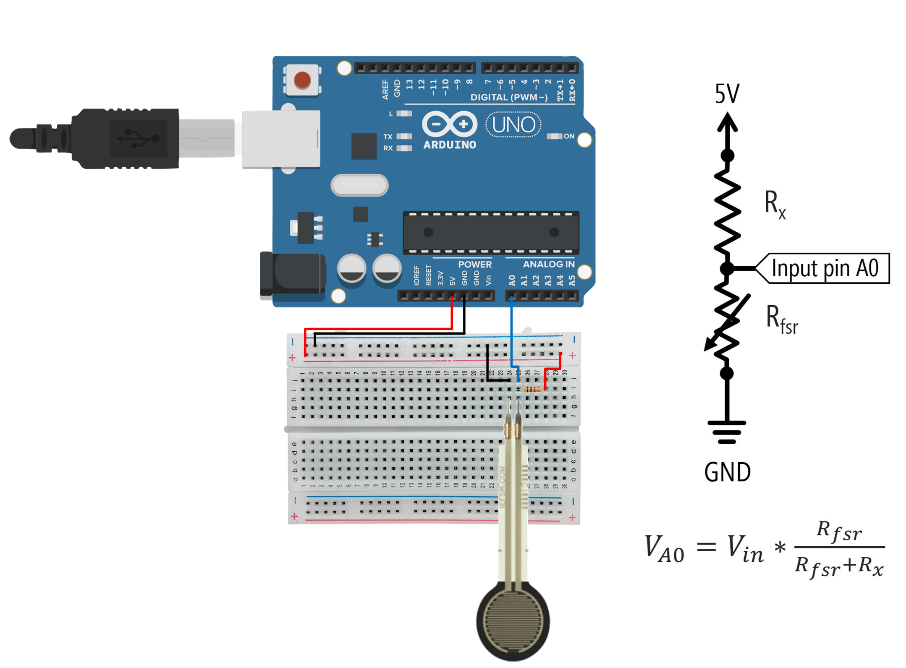
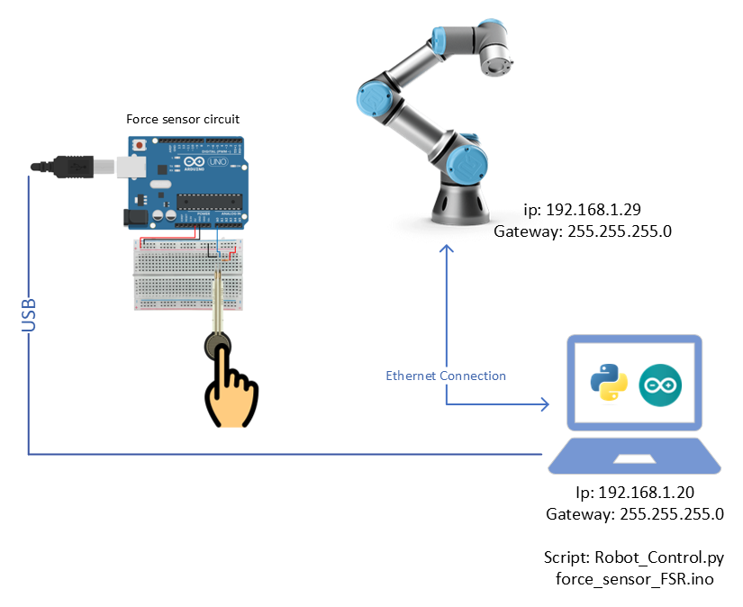
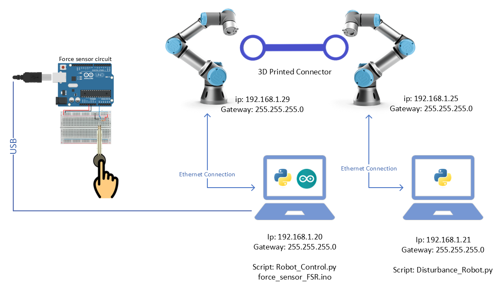
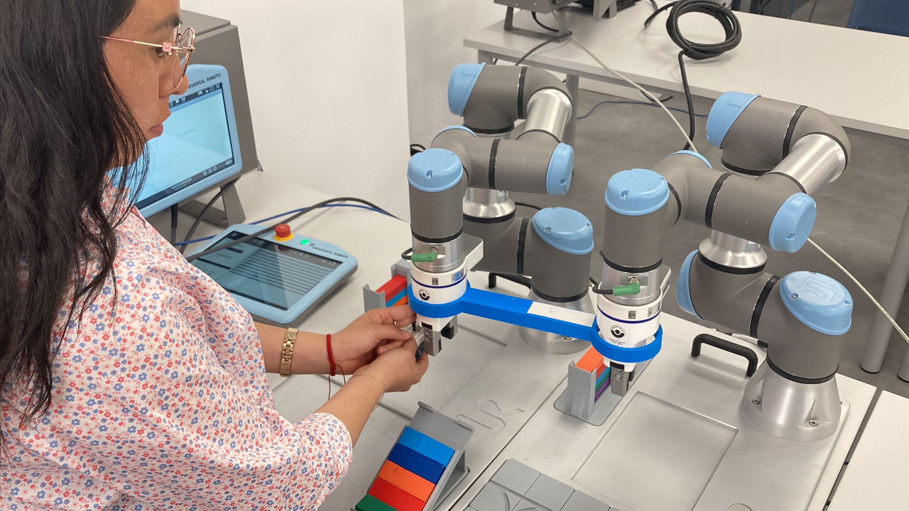

# WORK IN PROGRESS
----

# 🤖 Admittance Control for Reducing Human Physical Effort in Robot Programming through Motion Guidance

This repository contains Python scripts developed for experimental validation of **admittance control strategies** using a **UR3 collaborative robot**. The main goal is to reduce the **physical effort** required by human operators during the programming of linear trajectories, by simulating dynamic behaviors that guide robot motion through force interaction.

The system includes two main components:

- **Control Robot**: Implements an **admittance-based velocity controller** that simulates a **virtual mass-spring-damper system**. The controller restricts motion to a **single axis (X-axis)** and enables compliant, force-responsive movement during human-guided programming. This approach aims to replace the standard freedrive mode with a more controllable and ergonomic alternative, improving interaction quality and reducing user fatigue.

- **Disturbance Robot**: Applies controlled **sinusoidal forces** using the UR3's **force mode**, allowing the evaluation of the control robot’s responsiveness and robustness under external disturbances. It also includes functionality to react to sensor input (e.g., from an FSR) to simulate physical interaction or intentional interference.


---

## 🧪 Research Context & Contributions

This project supports a study on **minimizing human physical effort** in programming-by-demonstration for collaborative robots in industrial environments. The key contributions of this work include:

- ✅ Demonstrated the effectiveness of a **mass-based admittance control model** in reducing operator-applied force, particularly at **1 kg** and **5 kg** virtual mass settings.
- ✅ Validated the **feasibility of admittance control** in robots like the UR3, which do not support torque-level control required for classical impedance control.
- ✅ Compared the proposed method against adaptive and reinforcement-learning-based approaches, showing that a **fixed admittance model** can still achieve significant ergonomic improvements without added complexity.
- ✅ Replicated the concept of **constrained task spaces** by enforcing motion only along the X-axis, allowing for isolated and measurable force interaction.
- ✅ Provided a simpler, more accessible alternative to advanced adaptive methods, showing that **low-complexity controllers** can yield practical benefits in **stable, repetitive industrial tasks**.

This codebase has been used in a peer-reviewed research article focused on enhancing **human-robot interaction through force-guided motion**, contributing to the development of safer, more ergonomic collaborative robotics solutions.

---

## ✨ Features

This project provides a complete experimental framework for evaluating admittance control and external disturbance response in collaborative robots. The key features include:

### 🔧 Control Robot (Main UR3)
- **Admittance-Based Velocity Control**  
  Implements a velocity controller simulating a mass-spring-damper system to move the robot along the X-axis in response to user-applied force.

- **Linear Trajectory Execution**  
  Restricts movement to a single Cartesian axis to isolate interaction forces and facilitate analysis.

- **Predefined Pose Commands**  
  Includes options to move the robot to home or experimental starting positions for repeatable trials.

- **Freedrive Mode Toggle**  
  Allows switching between UR's built-in freedrive mode and the custom admittance control for comparison.

- **Force Sensor Integration**  
  Acquires external force data using a serial-connected piezoresistive sensor (e.g., FSR) to estimate interaction forces during motion.

- **Real-Time Data Logging**  
  Records time series data including target and actual velocity, applied force, estimated acceleration, and sensor voltage.

- **CSV Export for Analysis**  
  Automatically stores experimental data in CSV format for post-processing or visualization.

---

### 🔎 Disturbance Robot (Secondary UR3)
- **Sinusoidal Force Injection**  
  Uses RTDE force mode to apply a sinusoidal disturbance force along the X-axis, simulating real-world interaction or interference.

- **Reactive Pose Control Based on Sensor Input**  
  Reads voltage values from a force sensor and adjusts the robot’s pose depending on detected pressure level (low, medium, high).

- **Real-Time Control via RTDE**  
  Executes force control in real time with synchronized sampling, allowing precise modulation of applied external forces.

- **Pose Initialization and State Monitoring**  
  Includes diagnostic options to print robot pose, joint angles, and robot model information from the UR dashboard.

- **Dashboard Connection Testing**  
  Verifies connection with the robot’s dashboard server for status and readiness checks.

---

## ⚙️ Installation

This project was developed and tested on **Ubuntu Linux 22.04 LTS**, where all dependencies were successfully installed and executed using Python 3.

Follow these steps to set up the environment and run the scripts on a machine connected to the UR3 robot.

### 1. Clone the Repository

```bash
git clone https://github.com/rosmerhyh/UR3_Admittance_Control.git
cd UR3_Admittance_Control
```

### 2. (Optional) Create a Virtual Environment
```bash
python3 -m venv ur3_env
source ur3_env/bin/activate
```

### 3. Install Dependencies
```bash
pip install -r requirements.txt
```
The dependencies include:

- [`urx`](https://github.com/SintefManufacturing/python-urx): High-level UR robot control via socket interface
- [`ur-rtde`](https://pypi.org/project/ur-rtde/): Real-time control, data streaming, and force mode for UR robots
- [`pyserial`](https://pypi.org/project/pyserial/): Serial communication (used to read external sensor data)
- [`openpyxl`](https://pypi.org/project/openpyxl/): Export data to Excel format (optional)
- [`matplotlib`](https://matplotlib.org/stable/contents.html): Visualization of time-series data (force, velocity, acceleration)
- [`numpy`](https://numpy.org/doc/): Numerical computations

## 🔨 Experimental Setup

This project evaluates admittance control for collaborative programming tasks using a UR3 robot, focusing on reducing the operator’s physical effort. Two types of experiments were conducted to assess the controller’s effectiveness and robustness:

### 🔹 Circuit To Read Force Applied To The Sensor

- A voltage divider circuit was implemented using an Arduino to measure the force applied to an **FSR (Force Sensitive Resistor)**. The sensor is connected directly to the computer running the control robot script, and data is transmitted via serial communication.

The following image shows the schematic for the circuit:

*Figure 1: Circuit to read the force applied to the FSR sensor using a voltage divider connected to Arduino.*

### 🔹 Experiment 1: Admittance Control Without Disturbance

- A single UR3 robot was used.
- The operator physically guided the robot along a **linear trajectory** (X-axis only).
- Four motion control modes were tested:
  - **Freedrive** (UR’s built-in mode)
  - **Admittance control** with virtual mass values of `1 kg`, `5 kg`, and `10 kg`
- The objective was to evaluate whether lower-mass admittance settings reduced the force needed to move the robot compared to freedrive.


*Figure 2: Experimental setup for admittance control without disturbance.*

### 🔹 Experiment 2: Admittance Control With Disturbance (Sinusoidal Load)

- Two UR3 robots were used and **mechanically connected**.
- The **Control Robot** was operated by the human using the same linear path and the same four control modes (freedrive, 1 kg, 5 kg, 10 kg).
- Simultaneously, the **Disturbance Robot** applied a **sinusoidal force** along the X-axis using UR’s force mode, simulating interference from a tool.
- The goal was to evaluate how well the admittance control absorbed disturbances and maintained smooth, compliant motion under load.


*Figure 3: Experimental setup for admittance control with disturbance.*

---

### 🔹 Experiment 1 Video Test

In this video you can see the admittance control test in the experiment configuration without a second robot acting as a disturbance, press option 6 of the script and proceed to apply a force on the FSR sensor.

[](https://youtu.be/90aXgfmtC50)

### 🔹 Experiment Photos

<table>
  <tr>
    <td align="center">
      <br>
      <sub><b>Experiment 1:</b> Volunteer performing experiment 1</sub>
    </td>
    <td align="center">
      <br>
      <sub><b>Experiment 2:</b> Volunteer performing experiment 2</sub>
    </td>
  </tr>
  <tr>
    <td align="center">
      <br>
      <sub><b>Experiment 2:</b> Volunteer performing experiment 2</sub>
    </td>
    <td align="center">
      <br>
      <sub><b>Experiment 2:</b> Volunteer performing experiment 2</sub>
    </td>
  </tr>
</table>

## 🧪 How to Run the Experiment

This section explains how to set up and execute both experimental conditions: with and without external sinusoidal disturbance.

---

### 🧰 Equipment Required

- 2 Computers (one for each UR3 robot)
- 2 UR3 collaborative robots
- FSR sensor + Arduino (with USB cable)
- 3D printed part to mechanically connect the two robots (optional for disturbance)
- Local network (manual IP assignment)

---

### 🧪 Step-by-Step Instructions

1. **Prepare the Force Sensor**
   - Upload the `force_sensor_FSR.ino` sketch to the Arduino.
   - Ensure the Arduino is properly connected to the FSR sensor.
   - Connect the Arduino via USB to **Computer 1** (which will control the main robot).

2. **Configure the Main Robot (Control Robot)**
   - Connect **Computer 1** to the **Control UR3**.
   - Set a static IP (e.g., `192.168.1.29`) and update the `Control_Robot.py` script accordingly.
   - Run the script and select **option `25`** to move the robot to its initial pose.

3. **Select the Experiment Type**
   - For **Freedrive mode**, select **option `2`**.
   - For **Admittance control**, select **option `6`**.
     - Before executing, set the desired virtual mass (`1`, `5`, or `10`) inside the script.

4. *(Optional)* **Set Up the Disturbance Robot**
   - Connect **Computer 2** to the **Disturbance UR3**.
   - Assign a static IP (e.g., `192.168.1.25`) and update the `Disturbance_Robot.py` script accordingly.
   - Run the script and select **option `25`** to move it to its initial pose.

5. **Physically Connect the Robots (If Using Disturbance)**
   - Place both UR3 robots close enough to connect them via the **3D printed coupling piece**.

6. **Start the Disturbance Force**
   - On **Computer 2**, select **option `9`** to begin generating the sinusoidal opposing force.

7. **Run the Test**
   - On **Computer 1** (Control Robot), choose either:
     - Option `2` → **Freedrive with/without disturbance**
     - Option `6` → **Admittance control with/without disturbance**
   - Data will be collected automatically and saved as `.csv`.

---